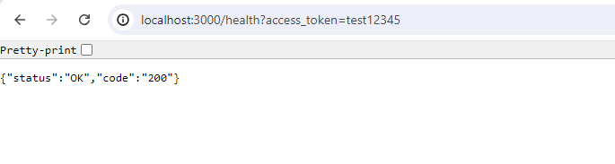
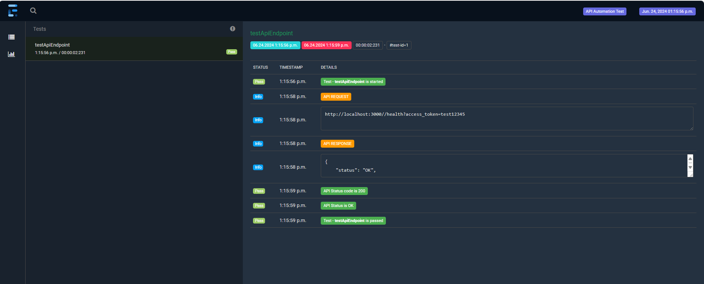

# sqa-secure-api-test
This project is written for testing the quest below: 
Please note that this is just a POC.
````
Quest 5 Git action (Security)  
1. goal: internal hacker try to change api end point, and SQA team need to prevent this kind of hacking
2. SQA applicant will make testing code 
3. Hacker change API env file and make PR, but testing can’t pass.
````

### Technology used:
* [Java](https://www.java.com/en/) - programming language
* [TestNG](https://github.com/cbeust/testng) - Testing framework
* [Maven](https://maven.apache.org/) - Build management tool
* [RestAssured](https://rest-assured.io/) - Testing and validating REST services
* [expressjs](https://expressjs.com/) - Express server for creating Rest API endpoint
* [ExtentReport](https://www.extentreports.com/docs/versions/5/java/index.html) - Reporting Framework
* [Lombok](https://projectlombok.org/) - Autocode generator (getters, setters, constructors, builders)


## Table of Contents
1. [Pre-requisites](#preReq)
1. [Requirements and Installation](#req)
1. [Steps to achieve the Quest test](#AchieveTest)
1. [Steps Implementation](#stepDesc)

### Pre-requisites <a name="preReq"></a>

You need to install git( [How to install git??](https://www.stanleyulili.com/git/how-to-install-git-bash-on-windows/)) and clone this project in your local computer.
```
git clone https://github.com/Anilkumar-Shrestha/sqa-secure-api-test.git
```

### Requirements and Installation <a name="req"></a>
<P> In order to utilise this project, you need to have the following below installed on your system.

1. [X] Java >=17 recommended version OR Java Software Development Kit (SDK).
1. [X] Set JAVA_HOME environmental variable
1. [X] Install Apache maven [Installation Guide](https://maven.apache.org/install.html)
1. [X] Install Nodejs [Installation steps](https://nodejs.org/en/download/package-manager)


### Steps to achieve the Quest test <a name="AchieveTest"></a>
For above quest to achieve, I followed below steps:
1. Create a simple API endpoint using expressjs server and dotenv which api access key is configurable via ENV file. [This is our APP]
2. As a SQA, I will write a test to check that API end point returns correct status. [As SQA, I have my own config file where api key is placed to test. Please note that test will be in different repo than app. But for this POC, i have made in same repo]
3. I wil create a CI pipeline in githubAction, where the test is executed on push request
3. To replicate the scenario where hacker changes API access token in env file, I will create a new branch `test_hacker_branch` where api key in ENV file is changed and PR is created.
4. With the CI setup in place, the test should be failed.


### Steps Implementation <a name="stepDesc"></a>
1. Set Up App server using expressjs
    1. Install express Server using npm:
   ``` 
   $  npm install --save express
   ```
    2. Install dotenv to manage environment variables:
   ``` 
   $ npm install dotenv 
   ```
    3. Start App Server using below cmd
   ``` 
   $ npm run start
   ```
   
   

2. Execute SQA test script to test the API end point:
   Test for api end point is checked by sending query params as `?access_token=$accessToken`. Test can be found on [ApiEndpointTest.java](src/test/java/com/api/automation/test/ApiEndpointTest.java).
   One can execute a test in local with below cmd [This will execute the test from [testng.xml](testng.xml) ]:
   ``` 
   $ mvn clean test
   ```
   This will give a test html report as below:
   

3. Create a github actions to execute the above test on code push or Pull Request.
   For this I have set up [ci.yml](.github/workflows/ci.yml) file, where test will be executed automatically on git push and pull request. You can update it to execute on pull request by updating
   line 3, from `on: [push, pull_request]` to `on: [ pull_request]`.

